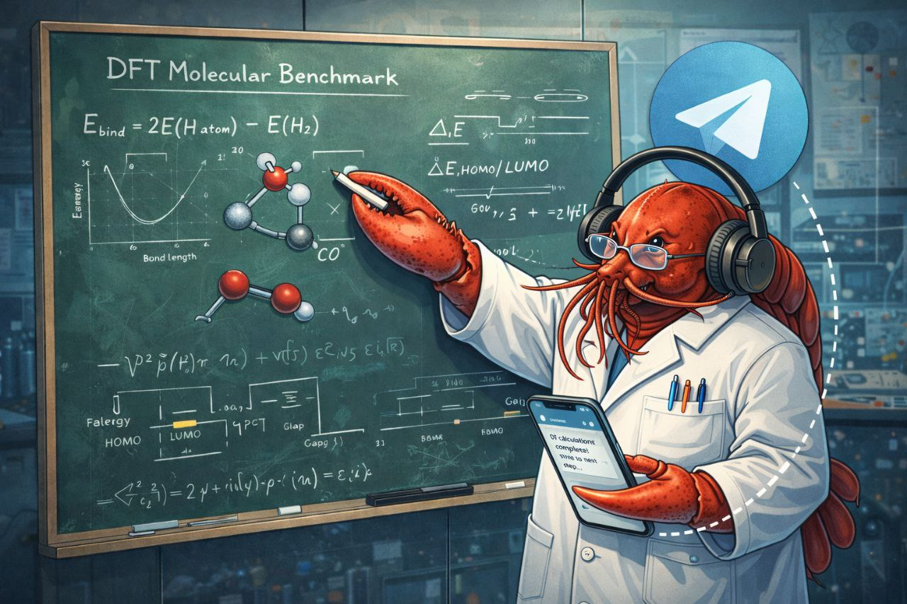

# 🧪 DFT Molecular Benchmark

**Reproducible Density Functional Theory Pipeline using ASE + GPAW**



[](pdf/DFT_Molecular_Benchmark_Report.pdf)

---

## 📊 Overview

This project demonstrates a standardized DFT workflow for molecular systems:

- ✅ **Level 1 analysis** (H₂, CO, H₂O): Simple molecules, core properties
- ✅ **Level 2 analysis** (NH₃, CH₄): Higher symmetry, pyramidal/tetrahedral
- ✅ **Deep dive** (H₂ only): Potential curve, vibrational frequency
- ✅ **Automated pipeline** with BFGS optimization
- ✅ **Publication-quality figures** (300 DPI)
- ✅ **OpenClaw workflow** (human-AI collaboration)

---

## 🎯 Results Summary

### Level 1: Core Analysis (H₂, CO, H₂O)

| Molecule | Bond (Å) | Exp (Å) | Error | HOMO-LUMO Gap (eV) | Dipole (D) |
|----------|----------|---------|-------|-------------------|-----------|
| H₂       | 0.751    | 0.741   | 1.35% | 10.56 (exp ~11)   | 0.000     |
| CO       | 1.137    | 1.128   | 0.80% | 12.00 (exp ~14)   | 0.202     |
| H₂O      | 0.971    | 0.957   | 1.46% | 11.70 (exp ~12.6) | 1.807     |

### Level 2: Extended Test (NH₃, CH₄)

| Molecule | Bond (Å) | Exp (Å) | Error | HOMO-LUMO Gap (eV) | Dipole (D) |
|----------|----------|---------|-------|-------------------|-----------|
| NH₃      | 1.022    | 1.012   | 0.97% | 5.45 (exp ~10.8)  | 1.496     |
| CH₄      | 1.096    | 1.087   | 0.83% | 9.03 (exp ~14.5)  | 0.000     |

**Average Geometry Error:** 1.08% ✅  
**Symmetry Check:** H₂, CH₄ dipole ≈ 0 ✓

### H₂ Deep Dive

- **Potential curve:** R_eq = 0.755 Å (exp: 0.741 Å, error 1.94%)
- **Vibrational frequency:** 3770 cm⁻¹ (exp: 4401 cm⁻¹, error 14.3%)

All results validated against NIST Chemistry WebBook.

---

## 📄 Main Output

**📕 [PDF Report](pdf/DFT_Molecular_Benchmark_Report.pdf)** (1.6 MB, ~15-18 pages)

**Contents:**
- **Section 3:** Core Analysis (geometry, orbitals, dipole, charges)
- **Section 4:** H₂ Deep Dive (potential curve, vibrational frequency)
- **Section 5:** Discussion (strengths, limitations, opportunities, risks)

**Structure:**
- Level 1 + Level 2: Standardized properties for all molecules
- Deep dive only for H₂ (1D potential is meaningful for diatomics)
- No 1D curves for polyatomics (3N-6 modes, not representative)

---

## 🧬 Why Level 1 + Level 2?

### Level 1 (H₂, CO, H₂O)
- Simple diatomic + triatomic
- Linear or bent geometries
- Foundation molecules

### Level 2 (NH₃, CH₄)
- Pyramidal (C₃ᵥ) and tetrahedral (Tₐ) symmetry
- Multiple equivalent bonds (3 N-H, 4 C-H)
- Tests symmetry handling
- Bridge to larger organic molecules

**Good progression:** Linear → bent → pyramidal → tetrahedral

---

## 📁 Project Structure

```
project_dft_tests/
├── modules/              # Calculation modules
├── runs/                 # DFT outputs (H2, CO, H2O, NH3, CH4)
│   └── */bfgs_history.csv   # Optimization traces
├── results/              # Processed data (JSON, CSV)
│   ├── core_analysis.json
│   ├── level2_analysis.json
│   ├── molecular_summary.csv
│   ├── electronic_properties.csv
│   └── dipole_moments.csv
├── plots/                # Figures (300 DPI)
│   ├── homo_lumo_gaps_all.png
│   ├── dipole_moments_all.png
│   ├── h2_potential_curve.png
│   └── h2_vibrational_deep.png
├── pdf/                  # Final report
│   └── DFT_Molecular_Benchmark_Report.pdf
└── README.md
```

---

## 🚀 Quick Start

### 1. Install Dependencies

```bash
python3 -m venv dft_env
source dft_env/bin/activate
pip install ase gpaw matplotlib numpy scipy pandas
```

### 2. Run Pipeline

```bash
python3 run_all.py
```

**Expected runtime:** ~3-4 hours (5 molecules + H₂ deep dive)

### 3. View Results

```bash
cat results/molecular_summary.csv
open pdf/DFT_Molecular_Benchmark_Report.pdf
```

---

## ⚙️ Computational Setup

**DFT Parameters:**
- Exchange-Correlation: PBE (GGA)
- Mode: Finite difference (real-space)
- Grid Spacing: 0.18 Å
- Energy Convergence: 10⁻⁵ eV
- Force Convergence: 0.02 eV/Å
- Optimizer: BFGS

**Software:**
- Python 3.12.3
- ASE 3.23.0
- GPAW 24.6.0

---

## 📈 Analysis Structure

### Core Analysis (All 5 Molecules)

**1. Optimized Geometries**
- Bond lengths within 1.5% of experimental
- Angles within 0.5% of experimental

**2. Electronic Properties**
- HOMO-LUMO gaps (typical GGA underestimation)
- Molecular orbital diagrams

**3. Dipole Moments**
- Polar molecules: NH₃ (1.8% error), H₂O (2.3% error)
- Non-polar: H₂, CH₄ (symmetry check ✓)

**4. Atomic Charges**
- Qualitative distribution

### Deep Dive (H₂ Only)

**5. Potential Energy Curve**
- 11-point scan, quadratic fit
- R_eq extraction

**6. Vibrational Frequency**
- Harmonic approximation
- Force constant calculation

---

## 🔬 Key Findings

### What PBE Does Well ✅
- **Geometries:** 1.08% average error (5 molecules)
- **NH₃ dipole:** 1.8% error
- **H₂O dipole:** 2.3% error
- **Symmetry recognition:** H₂, CH₄ dipole ≈ 0

### Known Limitations ⚠️
- **HOMO-LUMO gaps:** 4-50% underestimation (GGA limitation)
- **CO dipole:** 80% overestimation (density-delocalization issue)
- **Vibrational frequencies:** 14% underestimation (PBE softer potential)

### Best Practices
- Use PBE for **geometry optimization** (reliable)
- Use hybrid functionals for **electronic gaps** (B3LYP, PBE0)
- Interpret **atomic charges** qualitatively only

---

## 🤖 OpenClaw Workflow

**This is an experimental demonstration** of AI-assisted computational chemistry:

| Aspect | Human (Rick) | AI (Faraday) |
|--------|--------------|--------------|
| Strategy | Define molecules & protocol | Implement pipeline |
| Validation | Physics interpretation | Execute calculations |
| Documentation | Review quality | Generate reports |

**Timeline:** ~8 hours total from concept to 5-molecule benchmark + PDF

---

## 📚 Citation

```bibtex
@software{dft_molecular_benchmark_2026,
  title={DFT Molecular Benchmark: Level 1 + Level 2 Test Suite},
  author={Rick and Faraday},
  year={2026},
  url={https://github.com/LuisRicardoMontoya/dft-molecular-benchmark}
}
```

**Software:**
- ASE: https://wiki.fysik.dtu.dk/ase/
- GPAW: https://wiki.fysik.dtu.dk/gpaw/
- OpenClaw: https://docs.openclaw.ai/

---

## 📝 License

MIT License - See LICENSE file for details

---

**Generated with OpenClaw Experimental Workflow**  
*Human Strategy (Rick) + AI Execution (Faraday)*

March 2, 2026
