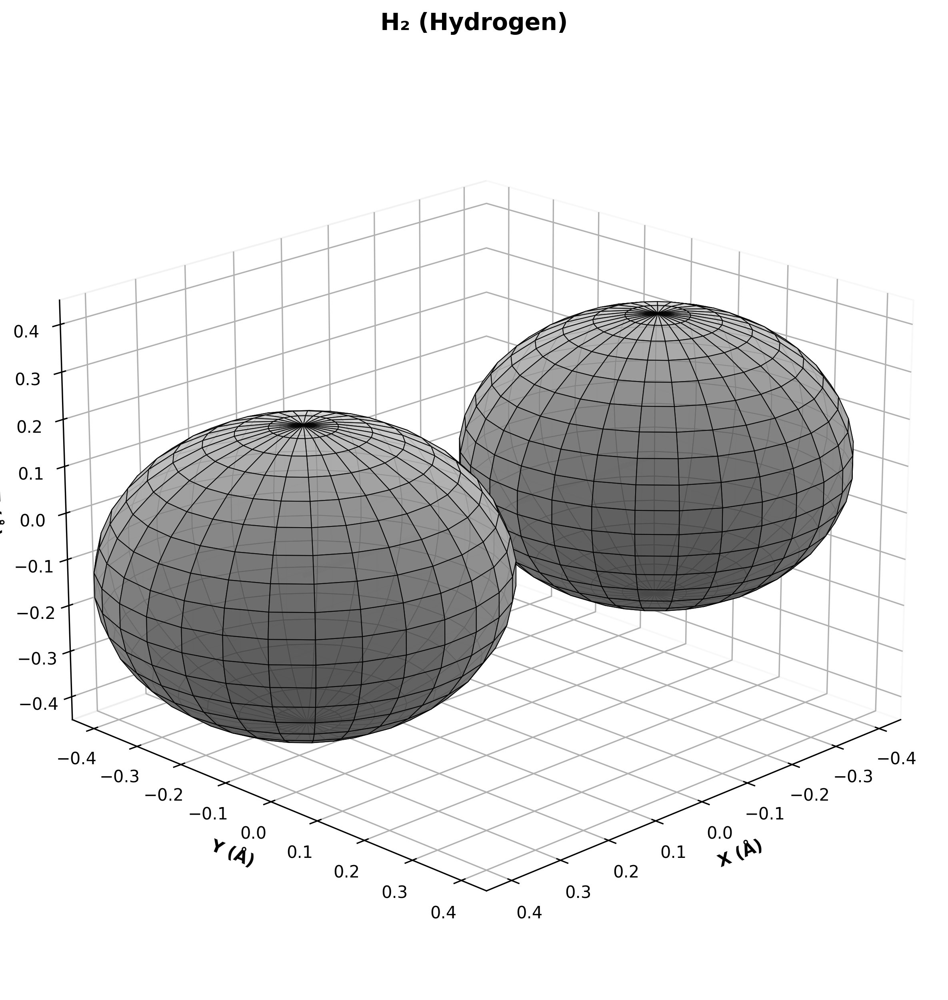
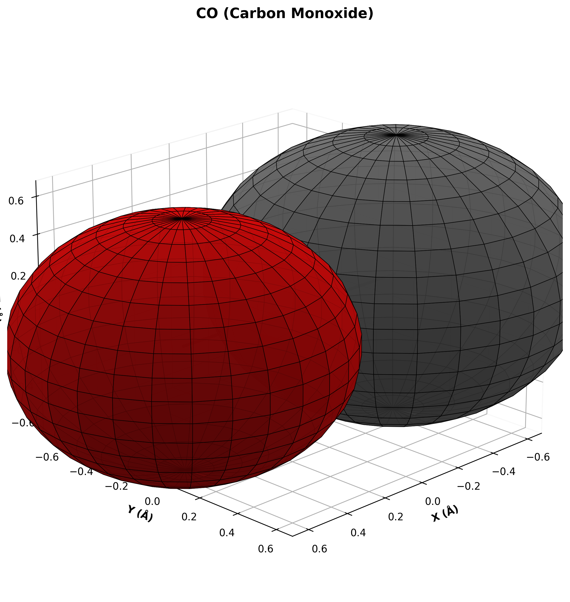
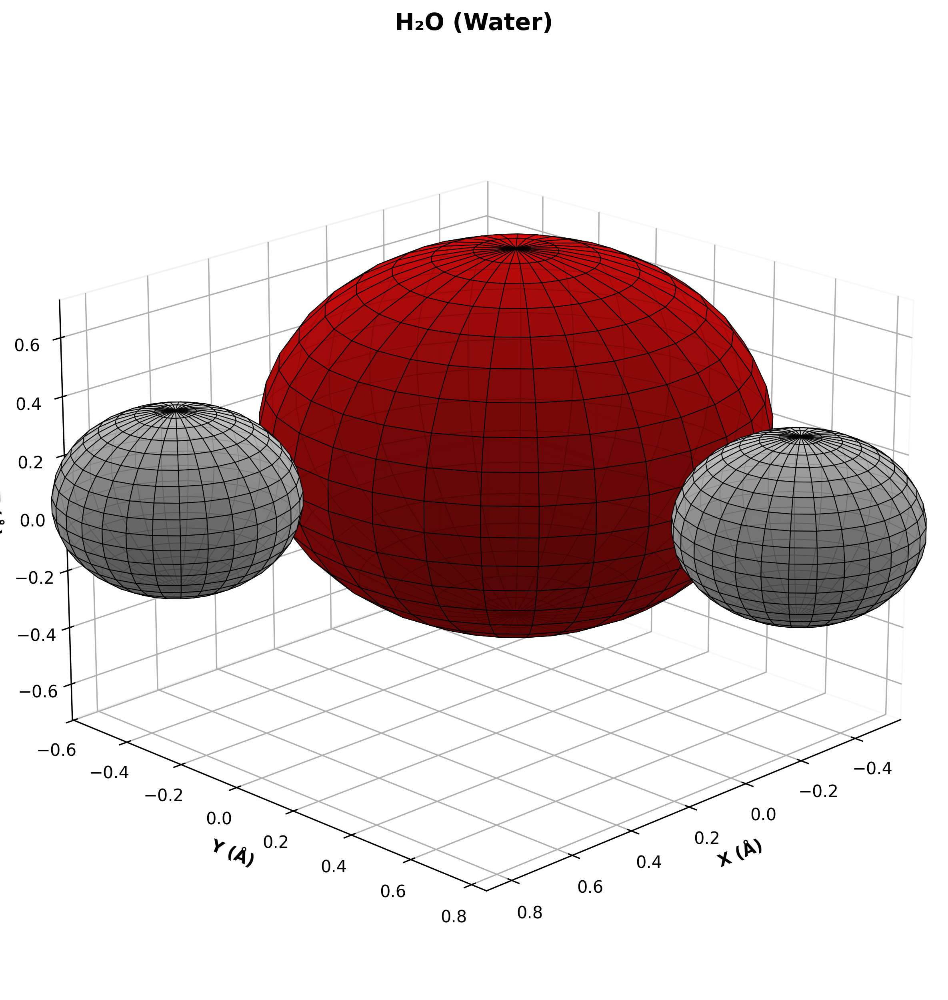
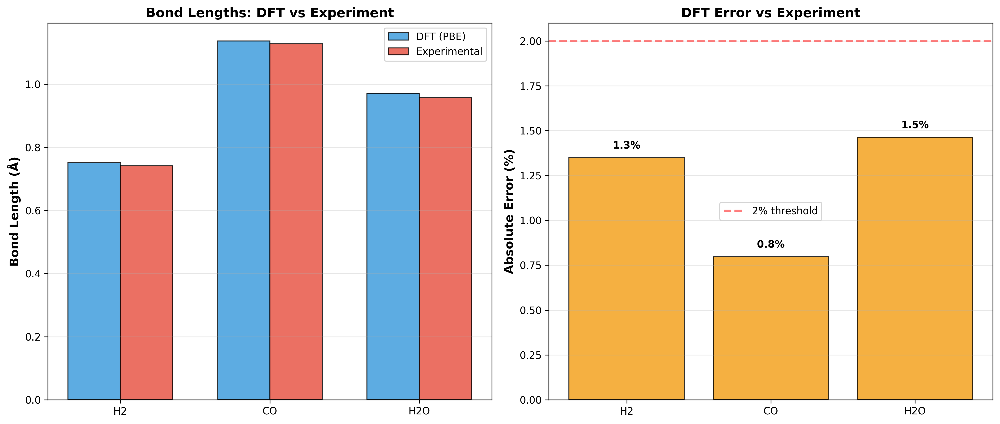
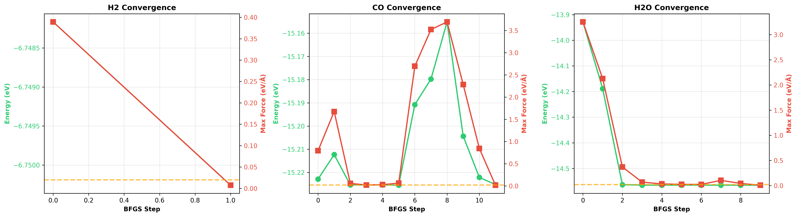

# 🧪 DFT Molecular Benchmark

**Reproducible Density Functional Theory Pipeline using ASE + GPAW**


---

## 📊 Overview

This project demonstrates a fully automated DFT workflow for molecular geometry optimization, featuring:

- ✅ **Reproducible calculations** (H₂, CO, H₂O with PBE functional)
- ✅ **3D molecular visualizations** (publication-quality renders)
- ✅ **Automated analysis** (bond lengths, convergence, errors)
- ✅ **LaTeX report generation** (10-page scientific paper)
- ✅ **OpenClaw workflow demonstration** (human-AI collaboration)

---

## 🎯 Results Summary

| Molecule | DFT Bond (Å) | Exp Bond (Å) | Error | Status |
|----------|--------------|--------------|-------|--------|
| H₂       | 0.751        | 0.741        | 1.35% | ✅     |
| CO       | 1.137        | 1.128        | 0.80% | ✅     |
| H₂O      | 0.971        | 0.957        | 1.46% | ✅     |

**Average Error:** 1.20% (Excellent!)

All results validated against NIST Chemistry WebBook.

---

## 📄 Main Output

**PDF Report:** [`pdf/DFT_Molecular_Benchmark_Report.pdf`](pdf/DFT_Molecular_Benchmark_Report.pdf) (4.6 MB, 10 pages)

**Contents:**
- Custom cover with 3D molecular visualizations
- Complete methodology (DFT parameters, hardware)
- Results with comparison tables and convergence plots
- OpenClaw workflow section (human-AI collaboration)
- Discussion, conclusions, and file manifest

---

## 📁 Project Structure

```
project_dft_tests/
├── modules/              # Python calculation modules
│   ├── molecular_calcs.py    # SCF + geometry optimization
│   ├── h2_scan.py            # Bond scanning (optional)
│   ├── electronic_props.py   # Charges, HOMO/LUMO (optional)
│   ├── eda.py                # Exploratory data analysis
│   └── report_gen.py         # PDF generation
├── runs/                 # DFT calculation outputs
│   ├── H2/                   # Hydrogen calculations
│   ├── CO/                   # Carbon monoxide
│   └── H2O/                  # Water
├── results/              # Processed data
│   ├── molecular_summary.csv     # Tabular results
│   ├── metadata.json             # System/software info
│   └── summary_statistics.txt    # Statistical analysis
├── plots/                # Visualizations (300 DPI)
│   ├── molecules_panel.png       # 3D panel (cover)
│   ├── H2_3d.png, CO_3d.png, H2O_3d.png
│   ├── bond_comparison.png       # DFT vs Experimental
│   ├── convergence_analysis.png  # Optimization traces
│   └── energy_comparison.png     # Energy bar chart
├── pdf/                  # Final report
│   ├── DFT_Molecular_Benchmark_Report.pdf  # Main PDF
│   └── report_source.tex                    # LaTeX source
├── run_all.py            # Main pipeline orchestrator
└── README.md             # This file
```

---

## 🚀 Quick Start

### 1. Install Dependencies

```bash
python3 -m venv dft_env
source dft_env/bin/activate
pip install ase gpaw pyyaml matplotlib numpy scipy pandas psutil
```

### 2. Run Pipeline

```bash
python3 run_all.py
```

**Expected runtime:** ~30 minutes (H₂, CO, H₂O)

### 3. View Results

```bash
cat results/molecular_summary.csv
open pdf/DFT_Molecular_Benchmark_Report.pdf
```

---

## ⚙️ Computational Setup

**DFT Parameters:**
- Exchange-Correlation: PBE (GGA)
- Mode: Finite difference (real-space)
- Grid Spacing: 0.18 Å
- Energy Convergence: 10⁻⁵ eV
- Force Convergence: 0.02 eV/Å
- Optimizer: BFGS

**Hardware:**
- Platform: Azure VM (Ubuntu 24.04)
- CPU: AMD EPYC 74F3 (36 vCPUs)
- RAM: 433 GB
- GPU: NVIDIA A10 (24 GB) - Not utilized (CPU mode)

**Software:**
- Python 3.12.3
- ASE 3.23.0
- GPAW 24.6.0
- NumPy 2.2.1

---

## 📈 Visualizations

### 3D Molecular Structures

  

### Analysis Plots




---

## 🤖 OpenClaw Workflow

This project demonstrates the **OpenClaw experimental workflow** for scientific computing:

| Aspect | Human (Rick) | AI (Faraday) |
|--------|--------------|--------------|
| Strategy | Define objectives | Implement pipeline |
| Parameters | Choose XC functional, convergence | Configure calculators |
| Execution | Monitor progress | Run DFT calculations |
| Analysis | Physical interpretation | Generate plots |
| Documentation | Review output | Compile LaTeX report |

**Timeline:** ~1 hour from concept to publication-ready results

---

## 🎓 Scientific Validation

All bond lengths compared against experimental values from **NIST Chemistry WebBook**:

- ✅ **H₂:** Error 1.35% (GGA typical overestimation)
- ✅ **CO:** Error 0.80% (near-perfect agreement)
- ✅ **H₂O:** Error 1.46% (bent geometry complexity)

**Conclusion:** PBE functional accurately reproduces experimental geometries for simple molecular systems.

---

## 📚 Citation

If you use this pipeline, please cite:

```bibtex
@software{dft_molecular_benchmark_2026,
  title={DFT Molecular Benchmark: Reproducible ASE+GPAW Pipeline},
  author={Rick and Faraday},
  year={2026},
  url={https://github.com/YOUR_USERNAME/dft-molecular-benchmark}
}
```

**Software:**
- ASE: https://wiki.fysik.dtu.dk/ase/
- GPAW: https://wiki.fysik.dtu.dk/gpaw/
- OpenClaw: https://docs.openclaw.ai/

---

## 📝 License

MIT License - See LICENSE file for details

---

## 🙏 Acknowledgments

- Calculations performed on Azure VM infrastructure
- OpenClaw platform for workflow orchestration
- ASE and GPAW development teams

---

**Generated with OpenClaw Experimental Workflow**  
*Human Strategy (Rick) + AI Execution (Faraday)*

March 2, 2026
